# Postmark

**A Uniswap v4 hook that charges 2 bps up front and sends the rest of the bill afterwards, to whoever actually caused the loss.**

UHI10 Hookathon · Sustainable Liquidity and MEV Protection

---

## The idea

Every MEV hook shipped so far protects LPs by charging *everyone* more when the weather looks bad — volatility fees, priority-fee taxes, reserve surcharges. None of them can tell the arbitrageur from the retail swapper at trade time, so they overcharge retail to underprice arbitrage.

Postmark inverts the sequence. It quotes a near-zero fee up front, writes a receipt, and settles the adverse selection **afterwards** — billing the specific counterparty who caused it, from a bond they posted, with the loss measured from the pool's own realized price path.

No signed oracle. No offchain sequencer. No priority-ordering assumption. The markout is computed from what the chain has already witnessed, and you cannot un-happen a price.

> EvenFlow taxes the weather. Postmark bills the driver.

## Why this is different

| Approach | Prices on | Why it falls short |
|---|---|---|
| Aegis DFM, Arrakis Pro, AdaptiveSwap | Realized volatility | Volatility is a proxy for the *probability* of toxic flow, not its identity. Charges retail for the arbitrageur's crime. |
| Angstrom L2 | Priority fee on the tx | Only works where the sequencer orders by tip. Blind on L1, on FCFS chains, and to out-of-band builder payments. |
| Angstrom L1 | Batch auction | Requires an entire offchain consensus network. That's a protocol, not a hook. |
| EvenFlow | Pool-wide surcharge | Surcharges the flow, not the counterparty. No attribution, no enforcement, no rebate for proven benign flow. |
| Brevis volume discount | Cumulative volume | Rewards the largest traders, who are disproportionately the informed ones. Wrong sign. |
| **Postmark** | **Realized markout, per payer, settled ex post** | — |

## How it works

```mermaid
sequenceDiagram
    participant P as Payer
    participant V as FlowVault
    participant H as PostmarkHook
    participant PM as PoolManager
    participant K as Anyone

    P->>V: deposit(bond)
    Note over P,V: opt-in, permissionless
    P->>PM: swap()
    PM->>H: beforeSwap
    H->>V: free bond >= required?
    H-->>PM: fee = tierFee(tier) — 2 / 8 / 15 / 30 bps
    PM->>H: afterSwap
    H->>V: lock(requiredBond)
    H->>H: write receipt + price observation
    Note over H: ...W blocks pass...
    K->>H: settle(receiptIds)
    H->>H: markout vs TWAP over W
    alt markout positive — LPs adversely selected
        H->>V: debit bond → LPs, keeper, rebate pool
    else markout zero or negative — benign
        H->>V: credit rebate to payer
    end
    H->>H: ScoreRegistry.update(payer, markout)
    H->>V: unlock bond
```



**Bonding is opt-in and only ever lowers your cost.** An unbonded address still swaps; it just lands in the top tier, which is the vanilla 30 bps baseline. That is the sybil answer, and it is structural rather than defensive.

**`beforeSwap` never reverts.** A bond too small for the swap's notional silently loses the discount rather than failing the trade. Reverting destroys router integration.

**Settlement is self-enforcing.** A payer's bond stays locked until their receipts settle, and the bond (2% of notional) is strictly larger than the maximum charge (1% of notional), so forfeiting is always worse than paying. Benign payers settle to unlock capital and claim rebates; the keeper cut covers everyone else. There is no settlement liveness problem, and the failure mode if nobody ever settles is a locked bond — it fails closed.

## Contracts

| Contract | Role | Status |
|---|---|---|
| [`PostmarkHook.sol`](src/PostmarkHook.sol) | v4 hook: `afterInitialize`, `beforeSwap`, `afterSwap` | fee quoting live; receipts and settlement pending |
| [`FlowVault.sol`](src/FlowVault.sol) | Bond escrow: deposit, withdraw, lock, debit, credit | live |
| [`ScoreRegistry.sol`](src/ScoreRegistry.sol) | Per-payer EWMA markout score, shared across all Postmark pools | live |
| `ReceiptBook.sol` | Packed open receipts per pool, ring buffer | not yet built |
| `PriceAccumulator.sol` | Cumulative tick observations for the settlement TWAP | not yet built |

Hook permissions are `AFTER_INITIALIZE | BEFORE_SWAP | AFTER_SWAP`. The pool must be created with `LPFeeLibrary.DYNAMIC_FEE_FLAG`, and the hook address is mined with `HookMiner`.

## Parameters

| Parameter | Value | Note |
|---|---|---|
| `tierFee[0]` | 2 bps | proven benign |
| `tierFee[1]` | 8 bps | |
| `tierFee[2]` | 15 bps | bonded, no settled history yet |
| `tierFee[3]` | 30 bps | unbonded or unknown — matches the vanilla baseline |
| `BOND_RATIO_BPS` | 200 (2% of notional) | locked per open receipt |
| `MAX_CHARGE_BPS` | 100 (1% of notional) | hard cap per receipt |
| `MIN_HISTORY` | 5 settled receipts | required before promotion past the entry tier |
| `LAMBDA_BPS` | 9000 (λ = 0.9) | EWMA retention |
| tier score bounds | 1 / 5 / 20 bps | EWMA realized markout, in bps of notional |
| `W` | 100 blocks | settlement window, ~20 min on mainnet. Set from measured data, see below |
| `alpha` | 0.6 | LVR recapture rate, must stay below 1 |
| `keeperBps` | 5% of charge | |
| `rebateShareBps` | 15% of charge | the rest, 80%, goes to LPs |
| `rebateCapRatio` | 0.5 | a rebate can never exceed half of fees paid |

`BOND_RATIO_BPS > MAX_CHARGE_BPS` is the invariant the whole mechanism rests on.

## Attack analysis

| | Attack | Defence | Test |
|---|---|---|---|
| **A1** | TWAP manipulation — push the price back before settlement to fake a benign markout | Pushing the price back genuinely does flip the markout sign; the defence is that it costs more than it saves. Tested as a two-world EV comparison — settle honestly vs manipulate and settle. **The attacker ends poorer.** | ✅ |
| **A2** | Sybil — a fresh address per swap | Reputation only ever lowers cost, and a fresh address cannot buy below the entry tier at any bond size. Over identical flow, rotating addresses paid **1.8e13 in fees against 8.9e12 — 2.02x** — for one address that settles its receipts. | ✅ |
| **A3** | Wash trading for rebates | The washer puts the entire proceeds straight back, so the token1 leg closes out exactly. Round trip **cost 3.0e12 of token0 and earned zero rebates**; a rebate is capped at half the fee that generated it. | ✅ |
| **A4** | Receipt spam — dust swaps to bloat state | 20 dust swaps wrote **zero receipts and locked zero bond**, having burned 3.9M gas. | ✅ |
| **A5** | Hook rug risk | `FlowVault`'s hook is set once, forever. A one-way guardian brake stops new receipts and bond locks while never blocking a swap, a settlement, an LP withdrawal, or a bond withdrawal. LP removal is exercised with a receipt open. | ✅ |

All five live in [test/Adversarial.t.sol](test/Adversarial.t.sol).

## Measured on real flow

627 real USDC/WETH swaps from mainnet, replayed through both pools ([scripts/backtest.py](scripts/backtest.py)).

| | Postmark | Vanilla 30 bps |
|---|---|---|
| LP PnL | **3,478 USDC** | 2,616 USDC |
| Fee paid by the most benign decile | **4.84 bps** | 30 bps |
| Fee paid by the most toxic decile | **46.83 bps** | 30 bps |
| Mean effective fee | 11.43 bps | 30 bps |

That is the claim, on data: **LPs end ahead while benign flow pays roughly a sixth of what a flat
pool charges it.** The toxic tail pays for it.

**The settlement window is what makes or breaks this, and it was set from the data.** At W = 5
blocks — 60 seconds — only 3,823 USDC of the 17,947 USDC of adverse selection had shown up yet, so
the pool collected the equivalent of 14 bps against a 30 bps baseline and **LPs were strictly worse
off than a flat pool**. Sixty seconds is simply too soon for the price to have told you who was
informed. At W = 100 the mechanism collects 31 bps equivalent. The cost is that a payer's bond stays
locked for the window.

**Chart 1 is a hockey stick, not a monotone staircase.** Deciles 1–7 sit flat at 3–6 bps, then D8
12, D9 23, D10 47. The benign deciles are flat because those swaps have near-zero markout, so their
effective fee is just the tier fee their payer's reputation earned — it does not vary with a decile
boundary. The honest description is a flat benign floor with a sharply rising toxic tail.

Caveat worth stating before this goes on a slide: 627 swaps over 1.4 days from 27 distinct payers is
a small sample, and the plan asks for bootstrap confidence intervals over days. Re-run over a longer
window before the deck.

## Stated limitations

Read these before the mechanism convinces you.

- **`donate()` pays whoever is in range at settlement time**, not necessarily the LPs who were harmed at swap time. v1 accepts this approximation; a per-tick snapshot accumulator is the v2 design.
- **Attribution is per-router in v1.** The payer resolves to whoever called `poolManager.swap`, which is usually a router. A router can attest to its end user by passing a 32-byte address in `hookData` — this works and is tested — but it is opt-in and self-reported. It is safe in the direction that matters: a router can only ever move cost *onto* an address it names, never off itself, because a named address with no bond lands in the top tier.
- **Bonds are ERC20-only and denominated in `currency1`**, the quote asset under v4's token ordering. Native bonds revert.
- **The charts are not yet regenerated.** The backtest harness is rewritten and its math is unit
  tested, but producing Chart 1 and Chart 2 needs an archive RPC (a free Alchemy or Infura key).
  The charts previously in this repo were generated by a simulation whose per-receipt cap was 50x
  the contract's and which omitted the upfront fee entirely, so they were removed rather than
  shipped.
- **`ScoreRegistry` has an owner-managed hook allowlist**, because it is shared across pools and cannot be a single immutable address. It holds no funds and can only ever lower a fee, so the blast radius of a bad entry is a mispriced fee on that hook's own pools — never a loss of principal. Production wants a timelock here.

## Build status

| Day | Milestone | Gate | Status |
|---|---|---|---|
| 1 | Scaffold, hook flags, address mining, dynamic-fee pool | a swap executes through the hook | ✅ |
| 2 | Bonds and tiers | bonded vs unbonded pay measurably different fees | ✅ |
| 3 | Receipts, observation ring, price accumulator | overhead under 40k, hard stop 80k | ⚠️ **77k steady state** |
| 4 | Settlement math | charge ≈ known realized LVR | ✅ **exact match** |
| 5 | Rebates, EWMA, cross-pool registry | benign payer's fee declines over 20 swaps | ✅ |
| 6 | Bond invariant property test | locked bond ≥ chargeable amount | ✅ |
| 7 | Adversarial suite | A1–A5 all lose money for the attacker | ✅ |
| 8 | Backtest harness | Chart 1 shows the staircase | ⚠️ harness verified, **charts need an archive RPC** |
| 9 | Deploy + scoreboard | a judge could open the URL and swap | ⚠️ deploy verified locally, no frontend |
| 10 | Freeze and docs | — | ⬜ |

**46 Solidity tests + 22 backtest-math checks, all green.**

### Gas

Measured against an identical vanilla pool under `forge test --isolate`, with **both pools warmed by
the same 270 swaps** — comparing a traded pool against a fresh one measures tick and bitmap state as
much as the hook.

| | Overhead |
|---|---|
| Steady state | **~108,000** |
| Split: quote + price observation, paid by every swap | ~46,000 |
| Split: receipt + bond lock, paid when a receipt is written | ~47,000 |

**This misses the plan's 80k hard stop, so Day 3 is red.** A cold `SSTORE` is 22,100 and the receipt
occupies two slots, so the reductions available are: emit the receipt as an event and keep only a
hash (~22k), fold `ScoreRegistry` into `FlowVault` so the quote is one external call against one
slot (~5–8k), and skip the observation when the tick has not moved (already done — lossless, since
the TWAP extrapolates at the last tick, though it saves nothing on flow that moves the tick every
swap). Together those land near 80k. Reaching 40k means not storing receipts on chain at all.

### Settlement correctness

The Day 4 gate, from [test/SettlementMath.t.sol](test/SettlementMath.t.sol). The scenario pins the
reference price analytically rather than reading it back out of the contract under test:

```
tick at execution   : 19
tick after market   : 99
expected TWAP tick  : 83        →  a 64-tick adverse move
notional            : 1e18
gross markout       : 64.2 bps  =  1.0001^64 − 1
charge              : 38.5 bps  =  α × 64.2, α = 0.6
```

Expected and actual matched to the wei.

## Working on this

[HANDOFF.md](HANDOFF.md) is the project overview — what's done, what's left, decisions already made, and the gotchas worth knowing before you touch the code. [WORKLOG.md](WORKLOG.md) is the running session-by-session log, updated at the end of every working session.

## Getting started

Requires [Foundry](https://book.getfoundry.sh/getting-started/installation).

```bash
git clone --recurse-submodules https://github.com/TechnicallyKiller/postmark
cd postmark
forge build
forge test
```

Already cloned without submodules:

```bash
git submodule update --init --recursive
```

Solidity 0.8.26, EVM target `cancun` (the hook uses transient storage to carry the resolved payer from `beforeSwap` into `afterSwap`).

### Gas numbers

```bash
forge test --isolate --match-path test/GasOverhead.t.sol -vv
```

`--isolate` matters: without it each call reuses warm storage and the figures understate what a
standalone transaction pays.

### Backtest and charts

Needs an **archive** RPC — the harness reads logs thousands of blocks back, and public endpoints
serve only head-adjacent blocks. A free Alchemy or Infura key is enough.

```bash
pip install pandas numpy matplotlib requests tqdm
export ETH_RPC_URL="https://eth-mainnet.g.alchemy.com/v2/<key>"
python3 scripts/backtest.py            # fetches, simulates, writes both charts
python3 scripts/backtest.py --cached   # re-run from swaps_cache.csv, no RPC calls
python3 scripts/test_backtest.py       # simulation math checks, writes no chart
```

The harness mirrors the contract's constants and reputation rules, and attributes each swap to the
Swap event's `sender` — the same per-router attribution the hook uses in v1, rather than an
idealised per-trader assumption.

### Deploy

```bash
export PRIVATE_KEY=0x...
export POOL_MANAGER=0x...        # v4 PoolManager on the target chain
export GUARDIAN=0x...            # optional, defaults to the deployer
export TOKEN0=0x... TOKEN1=0x... # optional, sorted; creates a dynamic-fee pool

forge script script/DeployPostmark.s.sol:DeployPostmark \
  --rpc-url unichain_sepolia --broadcast --verify
```

The hook address is mined against the canonical CREATE2 proxy so its low 14 bits carry the
permission flags. Mining against the EOA instead produces a salt that yields a different address
when broadcast, and the constructor's own check then reverts.

### Layout

```
src/
  PostmarkHook.sol        v4 hook surface, settlement, emergency brake
  FlowVault.sol           bond escrow, one slot per (payer, currency)
  ScoreRegistry.sol       cross-pool reputation
  base/BaseHook.sol       local BaseHook — v4-periphery moved theirs to a separate repo
  libraries/              ReceiptBook, PriceAccumulator, PostmarkMath, HookMiner
script/
  DeployPostmark.s.sol    mine, deploy, wire, optionally open a pool
test/
  PostmarkHook.t.sol      hook wiring, dynamic fee, access control, bond invariant
  SettlementMath.t.sol    Day 4 gate — charge vs independently computed LVR
  Adversarial.t.sol       A1–A5, each measuring the attacker's money
  FeeTiers.t.sol          tier resolution, bonded vs unbonded, router attestation
  FlowVault.t.sol         escrow, locks, cooldown, debit caps
  GasOverhead.t.sol       overhead vs an identical vanilla pool
  Verify_PartnerCode.t.sol  receipt-notional regressions
  utils/                  shared fixture
scripts/
  backtest.py             replay real mainnet flow, produce both charts
  test_backtest.py        simulation math checks
docs/
  BUILD_PLAN.md           the full ten-day plan
```

[HANDOFF.md](HANDOFF.md) · [WORKLOG.md](WORKLOG.md)

## Deployed addresses

**Unichain Sepolia** (chain id 1301), verified live on chain.

| Contract | Address |
|---|---|
| PostmarkHook | [`0xdB86D5Fd78174d6ACE2EB268DB12F29C335A10C0`](https://unichain-sepolia.blockscout.com/address/0xdB86D5Fd78174d6ACE2EB268DB12F29C335A10C0) |
| FlowVault | [`0x0F1bf92EE0C79F7Ca5C1e30E9412aD5BFF45c7C8`](https://unichain-sepolia.blockscout.com/address/0x0F1bf92EE0C79F7Ca5C1e30E9412aD5BFF45c7C8) |
| ScoreRegistry | [`0x9872b13257E958c2F7E4DcCc3F96b3C70c8e050c`](https://unichain-sepolia.blockscout.com/address/0x9872b13257E958c2F7E4DcCc3F96b3C70c8e050c) |
| v4 PoolManager | `0x00B036B58a818B1BC34d502D3fE730Db729e62AC` |

The hook address ends in **`10c0`** — that is not decoration. A v4 hook declares its permissions in
the low 14 bits of its own address, and `0x10c0` is `AFTER_INITIALIZE | BEFORE_SWAP | AFTER_SWAP`.
The address was mined to carry them, and the constructor rejects any address that does not.

Confirmed on chain: `vault.hook()` and `registry.isAuthorizedHook()` both point at the hook,
`W = 100`, withdraw cooldown 150 blocks, tier fees 200/800/1500/3000 pips, emergency brake not
engaged. Whole deploy cost 0.0000023 ETH.
