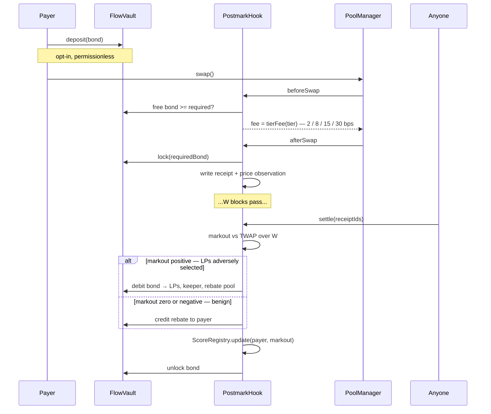

# Postmark

**A Uniswap v4 hook that charges 2 bps up front and sends the rest of the bill afterwards, to whoever actually caused the loss.**

UHI10 Hookathon · Sustainable Liquidity and MEV Protection

---

## The idea

Every MEV hook shipped so far protects LPs by charging *everyone* more when the weather looks bad — volatility fees, priority-fee taxes, reserve surcharges. None of them can tell the arbitrageur from the retail swapper at trade time, so they overcharge retail to underprice arbitrage.

Postmark inverts the sequence. It quotes a near-zero fee up front, writes a receipt, and settles the adverse selection **afterwards** — billing the specific counterparty who caused it, from a bond they posted, with the loss measured from the pool's own realized price path.

No signed oracle. No offchain sequencer. No priority-ordering assumption. The markout is computed from what the chain has already witnessed, and you cannot un-happen a price.

> EvenFlow taxes the weather. Postmark bills the driver.

## Why this is different

| Approach | Prices on | Why it falls short |
|---|---|---|
| Aegis DFM, Arrakis Pro, AdaptiveSwap | Realized volatility | Volatility is a proxy for the *probability* of toxic flow, not its identity. Charges retail for the arbitrageur's crime. |
| Angstrom L2 | Priority fee on the tx | Only works where the sequencer orders by tip. Blind on L1, on FCFS chains, and to out-of-band builder payments. |
| Angstrom L1 | Batch auction | Requires an entire offchain consensus network. That's a protocol, not a hook. |
| EvenFlow | Pool-wide surcharge | Surcharges the flow, not the counterparty. No attribution, no enforcement, no rebate for proven benign flow. |
| Brevis volume discount | Cumulative volume | Rewards the largest traders, who are disproportionately the informed ones. Wrong sign. |
| **Postmark** | **Realized markout, per payer, settled ex post** | — |

## How it works



**Bonding is opt-in and only ever lowers your cost.** An unbonded address still swaps; it just lands in the top tier, which is the vanilla 30 bps baseline. That is the sybil answer, and it is structural rather than defensive.

**`beforeSwap` never reverts.** A bond too small for the swap's notional silently loses the discount rather than failing the trade. Reverting destroys router integration.

**Settlement is self-enforcing.** A payer's bond stays locked until their receipts settle, and the bond (2% of notional) is strictly larger than the maximum charge (1% of notional), so forfeiting is always worse than paying. Benign payers settle to unlock capital and claim rebates; the keeper cut covers everyone else. There is no settlement liveness problem, and the failure mode if nobody ever settles is a locked bond — it fails closed.

## Contracts

| Contract | Role | Status |
|---|---|---|
| [`PostmarkHook.sol`](src/PostmarkHook.sol) | v4 hook: `afterInitialize`, `beforeSwap`, `afterSwap` | fee quoting live; receipts and settlement pending |
| [`FlowVault.sol`](src/FlowVault.sol) | Bond escrow: deposit, withdraw, lock, debit, credit | live |
| [`ScoreRegistry.sol`](src/ScoreRegistry.sol) | Per-payer EWMA markout score, shared across all Postmark pools | live |
| `ReceiptBook.sol` | Packed open receipts per pool, ring buffer | not yet built |
| `PriceAccumulator.sol` | Cumulative tick observations for the settlement TWAP | not yet built |

Hook permissions are `AFTER_INITIALIZE | BEFORE_SWAP | AFTER_SWAP`. The pool must be created with `LPFeeLibrary.DYNAMIC_FEE_FLAG`, and the hook address is mined with `HookMiner`.

## Parameters

| Parameter | Value | Note |
|---|---|---|
| `tierFee[0]` | 2 bps | proven benign |
| `tierFee[1]` | 8 bps | |
| `tierFee[2]` | 15 bps | bonded, no settled history yet |
| `tierFee[3]` | 30 bps | unbonded or unknown — matches the vanilla baseline |
| `BOND_RATIO_BPS` | 200 (2% of notional) | locked per open receipt |
| `MAX_CHARGE_BPS` | 100 (1% of notional) | hard cap per receipt |
| `MIN_HISTORY` | 5 settled receipts | required before promotion past the entry tier |
| `LAMBDA_BPS` | 9000 (λ = 0.9) | EWMA retention |
| tier score bounds | 1 / 5 / 20 bps | EWMA realized markout, in bps of notional |
| `W` | ~60s of blocks | settlement window, configurable per pool |
| `alpha` | 0.6 | LVR recapture rate, must stay below 1 |
| `keeperBps` | 5% of charge | |
| `rebateCapRatio` | 0.5 | a rebate can never exceed half of fees paid |

`BOND_RATIO_BPS > MAX_CHARGE_BPS` is the invariant the whole mechanism rests on.

## Attack analysis

| | Attack | Defence | Test |
|---|---|---|---|
| **A1** | TWAP manipulation — push the price back before settlement to fake a benign markout | The reference is a TWAP across W blocks, not a spot read. Holding a manipulated TWAP costs roughly what others arbitrage from you every block of the window; since α < 1, the recoverable saving is strictly less than the manipulation cost. | pending |
| **A2** | Sybil — a fresh address per swap | Reputation only ever lowers cost, and fresh addresses start at the top tier. There is no blacklist to escape. A determined arbitrageur just always pays 30 bps, which is what they should pay. | pending |
| **A3** | Wash trading for rebates | `rebateCapRatio < 1`, so round-tripping is strictly negative EV. | pending |
| **A4** | Receipt spam — dust swaps to bloat state | `dustThreshold`, and the spammer pays the storage gas themselves. | pending |
| **A5** | Hook rug risk | `FlowVault`'s hook address is set once and can never change. Emergency mode pauses swaps while never blocking LP withdrawals. | partial — vault immutability [tested](test/FlowVault.t.sol) |

## Stated limitations

Read these before the mechanism convinces you.

- **`donate()` pays whoever is in range at settlement time**, not necessarily the LPs who were harmed at swap time. v1 accepts this approximation; a per-tick snapshot accumulator is the v2 design.
- **Attribution is per-router in v1.** The payer resolves to whoever called `poolManager.swap`, which is usually a router. A router can attest to its end user by passing a 32-byte address in `hookData` — this works and is tested — but it is opt-in and self-reported. It is safe in the direction that matters: a router can only ever move cost *onto* an address it names, never off itself, because a named address with no bond lands in the top tier.
- **Bonds are ERC20-only and denominated in `currency1`**, the quote asset under v4's token ordering. Native bonds revert.
- **`ScoreRegistry` has an owner-managed hook allowlist**, because it is shared across pools and cannot be a single immutable address. It holds no funds and can only ever lower a fee, so the blast radius of a bad entry is a mispriced fee on that hook's own pools — never a loss of principal. Production wants a timelock here.

## Build status

| Day | Milestone | Gate | Status |
|---|---|---|---|
| 1 | Scaffold, hook flags, address mining, dynamic-fee pool | a swap executes through the hook | ✅ |
| 2 | Bonds and tiers | bonded vs unbonded pay measurably different fees | ✅ |
| 3 | Receipts, ring buffer, price accumulator | per-swap gas overhead measured, under 40k | ⬜ |
| 4 | Settlement math | a synthetic arb trade is charged ≈ its known realized LVR | ⬜ |
| 5 | Rebates, EWMA, cross-pool registry | a benign payer's effective fee declines across 20 swaps | ⬜ |
| 6 | Bond invariant property test | `minBond(notional) > maxCharge(notional)` for all inputs | ⬜ |
| 7 | Adversarial suite | A1–A5 all fail for the attacker | ⬜ |
| 8 | Backtest harness | effective-fee-by-decile chart shows the staircase | ⬜ |
| 9 | Unichain Sepolia deploy + scoreboard | a judge can open the URL and swap | ⬜ |
| 10 | Freeze and docs | — | ⬜ |

**19 tests passing** across 3 suites — 10 vault, 5 hook, 4 fee-tier.

## Getting started

Requires [Foundry](https://book.getfoundry.sh/getting-started/installation).

```bash
git clone --recurse-submodules https://github.com/TechnicallyKiller/postmark
cd postmark
forge build
forge test
```

Already cloned without submodules:

```bash
git submodule update --init --recursive
```

Solidity 0.8.26, EVM target `cancun` (the hook uses transient storage to carry the resolved payer from `beforeSwap` into `afterSwap`).

### Layout

```
src/
  PostmarkHook.sol        v4 hook surface
  FlowVault.sol           bond escrow
  ScoreRegistry.sol       cross-pool reputation
  base/BaseHook.sol       local BaseHook — v4-periphery moved theirs to a separate repo
  libraries/              PostmarkMath, HookMiner
test/
  PostmarkHook.t.sol      hook wiring, dynamic fee, access control
  FeeTiers.t.sol          tier resolution, bonded vs unbonded, router attestation
  FlowVault.t.sol         escrow, locks, cooldown, debit caps
  utils/                  shared fixture
docs/
  BUILD_PLAN.md           the full ten-day plan
```

## Deployed addresses

Not yet deployed. Unichain Sepolia is scheduled for Day 9.
